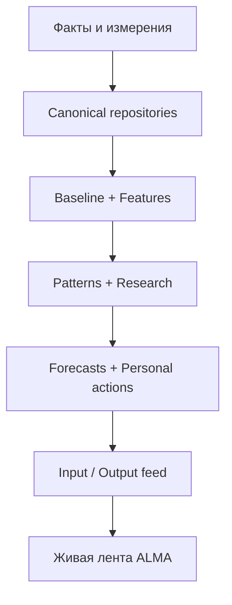

# Архитектура ALMA V1.2

## Назначение

ALMA — не дневник, который человек обязан постоянно заполнять. Основной цикл продукта:

> автоматическое наблюдение → гипотеза → минимальный недостающий ввод → паттерн → прогноз → адаптация → эксперимент → результат → персональное знание

Детерминированный Core работает без LLM. Будущий AI может распознавать свободный ввод или улучшать формулировки, но не является источником фактов и не удерживает архитектуру.

## Слои

1. **Presentation** — существующий тёмный мобильный интерфейс, лотос, дуга дат, волны и вертикальная лента блоков.
2. **Compatibility** — перевод прежних UI-моделей и локального snapshot в канонические записи без big-bang rewrite.
3. **Canonical data** — observations, events, symptom episodes, context periods, planned events и отдельные производные сущности.
4. **Registries** — декларативные определения метрик и источников, доступность adapters, нормализация и приоритет источников.
5. **Local-first storage and sync** — локальная база, outbox, стабильные UUID, версии, конфликтная защита и Supabase transport.
6. **Deterministic Core** — Baseline, Feature, Pattern, Hypothesis, Research, Forecast и Recommendation engines.
7. **Communication** — Input Request, Output Feed, Narrative и Contact engines.
8. **Knowledge adapters** — Scientific, Population и Safety interfaces с честным `unavailable`, пока проверенные базы не подключены.

## Поток данных

Inference, forecast и plan не возвращаются в исторический evidence как факты. Подтверждённое плановое событие создаёт отдельное фактическое событие.

## Оркестрация

`recalculatePersonalModel` запускается после изменения исторического факта, удаления, смены канонического источника или получения удалённого исторического обновления. Dirty ranges очищаются только после успешного пересчёта и восстанавливаются при ошибке.

Оркестратор:

- выбирает только measured/user-confirmed и не synthetic evidence;
- обновляет историю baseline и dynamic features;
- проверяет lag, inverse, cumulative и interaction candidates;
- эволюционирует или завершает patterns;
- обновляет Research Quests и выбирает минимальный запрос;
- разрешает прежние forecasts и создаёт только проверяемые новые;
- создаёт только немедицинские recommendations, personal tools и experiments;
- публикует immutable feed item только при содержательном изменении.

## Расширяемость

Новая метрика добавляется в registry и подключается через adapter/repository, не через новый параллельный pipeline. HealthKit, Oura, Android Usage, Population, runtime LLM и медицинские knowledge bases сейчас не симулируются: для них существуют только rails/interfaces.

## Текущие границы prototype

- браузерный storage adapter использует `localStorage`; контракт допускает замену на IndexedDB без смены repositories;
- аналитика запускается локально после sync; отдельный серверный background worker ещё не создан;
- production deployment не заменяется рефакторингом до ручного принятия Preview.
